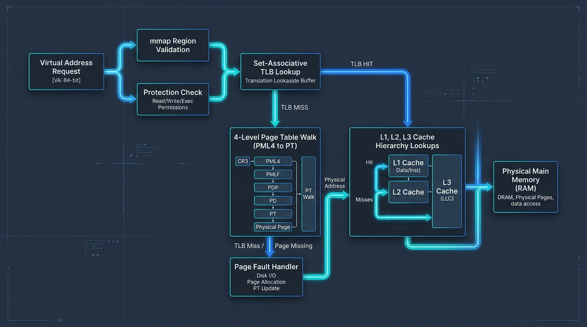
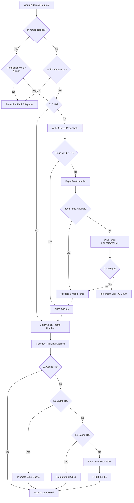
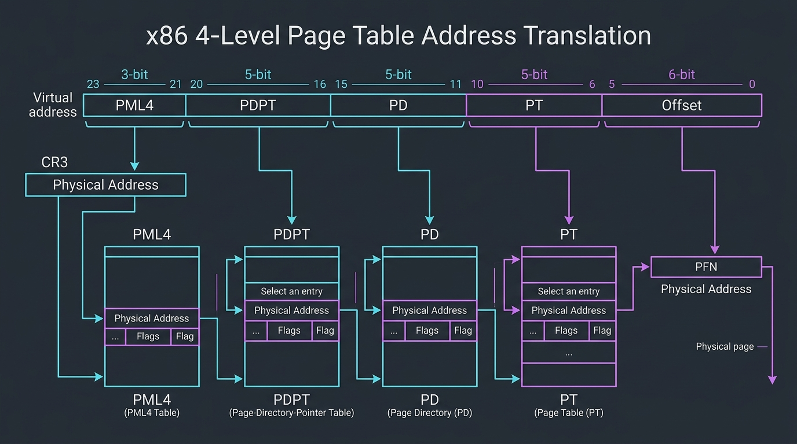
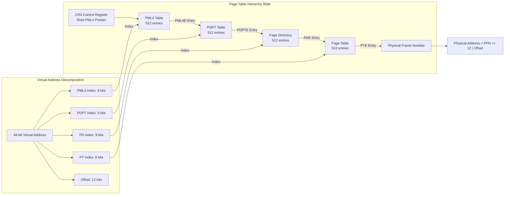
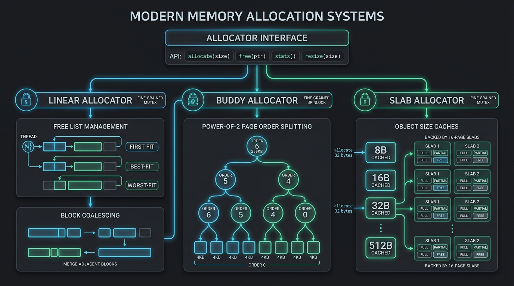
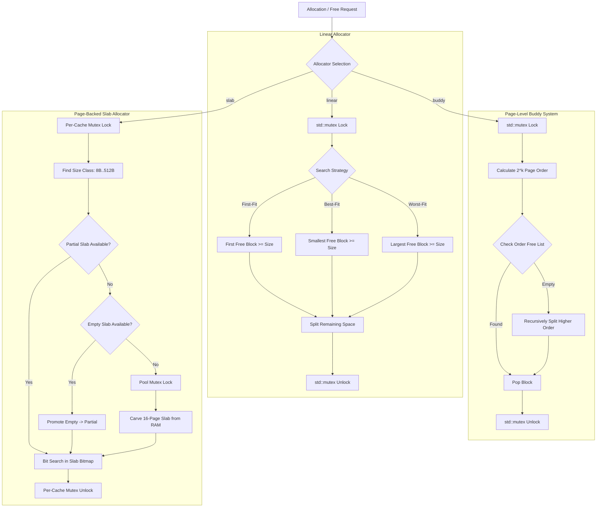
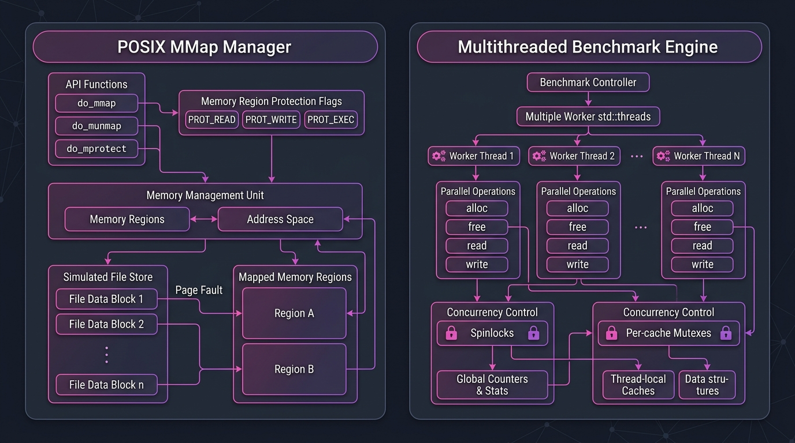
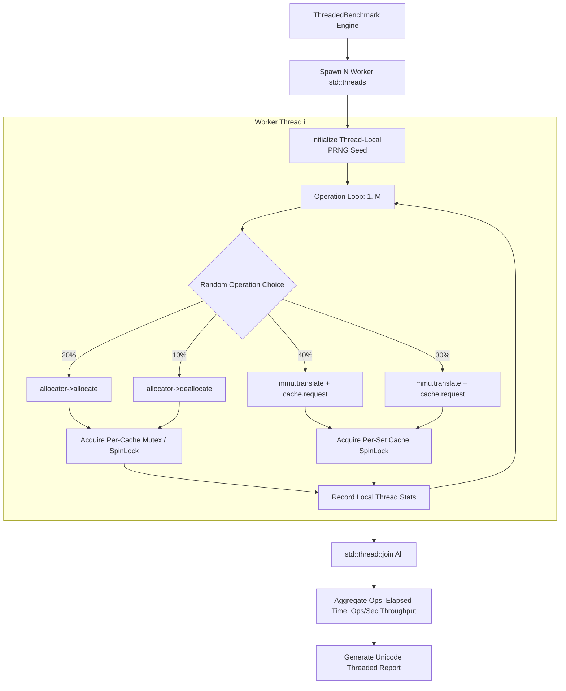

# Multi-Threaded Memory Management & Cache Simulator

[](https://en.wikipedia.org/wiki/C%2B%2B17)
[](Makefile)
[](src/ThreadSafety.h)
[](LICENSE)

An end-to-end virtual-to-physical memory pipeline simulator built in C++17. Features thread-safe memory allocators (Buddy, Slab, Linear with First/Best/Worst-Fit), a multi-level L1–L3 cache hierarchy with replacement policies, x86-style 4-level page tables, POSIX-style `mmap`/`munmap`/`mprotect` simulation, a multi-threaded stress-testing engine, and real-time ANSI terminal visualization.

> 🎬 **Demo Video Link**: [Google Drive Folder](https://drive.google.com/drive/folders/1cSmt-6Zfgw_Jq5v-c1NR68WgH02OSKN_?usp=drive_link)

---

## 📋 Table of Contents

- [System Architecture & Visual Flowcharts](#-system-architecture--visual-flowcharts)
  - [1. Full Virtual Memory Pipeline Flow](#1-full-virtual-memory-pipeline-flow)
  - [2. x86 4-Level Page Table Translation Flow](#2-x86-4-level-page-table-translation-flow)
  - [3. Memory Allocator Architecture & Fine-Grained Locking](#3-memory-allocator-architecture--fine-grained-locking)
  - [4. POSIX MMap Manager & Multithreaded Concurrency Architecture](#4-posix-mmap-manager--multithreaded-concurrency-architecture)
- [✨ Key Features](#-key-features)
- [📁 Project Structure](#-project-structure)
- [🛠️ Build & Installation](#️-build--installation)
- [🚀 Interactive CLI Reference](#-interactive-cli-reference)
- [🧪 Running Test Suites](#-running-test-suites)
- [📊 Performance Benchmarks & AMAT](#-performance-benchmarks--amat)

---

## 📐 System Architecture & Visual Flowcharts

### 1. Full Virtual Memory Pipeline Flow

Every virtual address read/write request passes through a multi-tier memory system comprising TLB translation, multi-level page tables, mmap region validation, L1–L3 cache lookups, and simulated physical RAM.



<details>
<summary><b>View Interactive Mermaid Flowchart</b></summary>


</details>

---

### 2. x86 4-Level Page Table Translation Flow

The simulator features an x86-style 4-level hierarchical page table (`PML4` → `PDPT` → `PD` → `PT`), decomposing a 48-bit virtual address into 4 level indices plus an offset.



<details>
<summary><b>View Interactive Mermaid Diagram</b></summary>


</details>

---

### 3. Memory Allocator Architecture & Fine-Grained Locking

Three polymorphic memory allocators inherit from the unified `Allocator` interface, secured with fine-grained concurrency control to eliminate global lock contention.



<details>
<summary><b>View Interactive Mermaid Flowchart</b></summary>


</details>

---

### 4. POSIX MMap Manager & Multithreaded Concurrency Architecture

The `MMapManager` provides dynamic virtual memory mapping, region tracking, and protection verification, while the `ThreadedBenchmark` engine manages concurrent `std::thread` workers.



<details>
<summary><b>View Interactive Mermaid Diagram</b></summary>


</details>

---

## ✨ Key Features

- **Polymorphic Memory Allocators**:
  - **Linear Allocator**: Doubly-linked free list supporting First-Fit, Best-Fit, and Worst-Fit algorithms with automatic adjacent block coalescing.
  - **Page-Level Buddy Allocator**: Power-of-2 page order management (`alloc_pages` model), recursive block splitting and buddy merging up to order 6.
  - **Slab Allocator**: Linux kernel-style slab caches for dedicated object size classes (8B, 16B, 32B, 64B, 128B, 256B, 512B) backed by 16-page slabs.
- **Fine-Grained Locking & Concurrency**:
  - Lightweight atomic flag `SpinLock` with yield fallback for high-throughput cache set locking.
  - Fine-grained per-cache mutexes allowing concurrent allocation across different size classes.
  - `ThreadedBenchmark` engine running real `std::thread` workers achieving >500k ops/sec throughput.
- **Multi-Level Page Tables & MMU**:
  - x86-style 4-level page table (`PML4` → `PDPT` → `PD` → `PT`) with sparse on-demand intermediate table allocation.
  - Page-table walk cost tracking (counting memory accesses per walk step).
  - Set-associative Translation Lookaside Buffer (TLB) with LRU replacement and TLB shootdown invalidation.
  - Demand paging with page fault handling and LRU/FIFO/Clock eviction.
- **POSIX-Style `mmap` Simulation**:
  - Dynamic virtual address region mapping (`do_mmap`), unmapping (`do_munmap`), and protection modification (`do_mprotect`).
  - Region permission validation (`MM_PROT_READ`, `MM_PROT_WRITE`, `MM_PROT_EXEC`).
  - Simulated file-backed mappings with backing store creation.
- **Cache Hierarchy (L1 → L2 → L3)**:
  - 3-level set-associative cache hierarchy with configurable capacity, block size, and associativity.
  - Configurable replacement policies (LRU, FIFO, LFU) and dirty-line writeback propagation.
  - Per-set atomic spinlocks enabling concurrent set lookups.
- **Benchmarking & Visualization**:
  - SPEC CPU trace parser and 6 synthetic trace generators (Sequential, Random, Temporal, Strided, SPEC_INT, SPEC_FP).
  - Average Memory Access Time (AMAT) calculation taking into account TLB, L1-L3 hits/misses, walk costs, and disk I/O penalties.
  - ANSI terminal visualization rendering memory maps, fragmentation gauges, slab bitmaps, and cache heatmaps.

---

## 📁 Project Structure

```
Memory-Managment/
├── Makefile                     # Build script with C++17, -pthread, and debug/bench targets
├── main.cpp                     # Interactive CLI simulator entry point
├── README.md                    # System documentation and architecture guide
├── docs/images/                 # High-resolution architectural flowcharts & visual diagrams
│   ├── virtual_memory_pipeline.jpg
│   ├── x86_page_table_walk.jpg
│   ├── memory_allocators.jpg
│   └── posix_mmap_and_multithreading.jpg
├── src/
│   ├── Allocator.h              # Abstract base class for memory allocators & PAGE_SIZE definition
│   ├── MemoryAllocator.h/.cpp   # Linear allocator (First/Best/Worst-fit, coalescing, mutex)
│   ├── BuddyAllocator.h/.cpp    # Page-level Buddy allocator (Power-of-2 orders, recursive merge)
│   ├── SlabAllocator.h/.cpp     # Page-backed Slab allocator (8B..512B caches, per-cache mutex)
│   ├── ThreadSafety.h           # Atomic SpinLock & SpinLockGuard RAII primitives
│   ├── Cache.h/.cpp             # 3-level set-associative cache hierarchy (per-set SpinLock)
│   ├── MultiLevelPageTable.h/.cpp # x86-style 4-level page table (PML4, PDPT, PD, PT, walk cost)
│   ├── VirtualMemory.h/.cpp     # MMU, set-associative TLB, page fault handler, evictions
│   ├── MMap.h/.cpp              # POSIX mmap/munmap/mprotect region manager & file store
│   ├── TraceBenchmark.h/.cpp    # Trace parser, synthetic workload generator, AMAT calculator
│   ├── ThreadedBenchmark.h/.cpp # Multithreaded std::thread stress-testing engine
│   └── Visualization.h/.cpp     # ANSI terminal visualizer (gauges, heatmaps, bitmaps)
├── tests/                       # CLI script test inputs
│   ├── test1.txt .. test7.txt   # Baseline allocator & cache tests
│   ├── test_multilevel.txt      # 4-level page table walk test
│   ├── test_mmap.txt            # POSIX mmap/munmap/mprotect region test
│   ├── test_benchmark.txt       # Trace-driven benchmark suite (Sequential, Random, SPEC)
│   ├── test_threaded.txt        # Multithreaded std::thread stress test
│   └── test_viz.txt             # Visualizer output test
└── output/                      # Saved test run logs
    ├── test_multilevel_out.txt
    ├── test_mmap_out.txt
    ├── test_benchmark_out.txt
    └── test_threaded_out.txt
```

---

## 🛠️ Build & Installation

### Prerequisites
- **Compiler**: `g++` or `clang++` with C++17 support
- **OS**: macOS or Linux
- **Tools**: `make`, `pthread` library support

### Building the Project

```bash
# Clone the repository
git clone https://github.com/balaji345-max/Memory-Managment.git
cd Memory-Managment

# Build debug target
make clean && make

# Build optimized benchmark binary (-O2)
make bench
```

---

## 🚀 Interactive CLI Reference

Run the executable interactively:
```bash
./memsim
```

### Command Summary Table

| Command | Description |
|---|---|
| `init memory <size>` | Initialize system physical memory size in bytes |
| `set allocator <type>` | Set active allocator (`buddy`, `slab`, `first_fit`, `best_fit`, `worst_fit`) |
| `set cache_policy <pol>` | Set cache replacement policy (`LRU`, `FIFO`, `LFU`) |
| `set page_policy <pol>` | Set page replacement policy (`LRU`, `FIFO`, `CLOCK`) |
| `set pagetable <mode>` | Toggle page table mode (`flat` or `multilevel`) |
| `set viz <on\|off>` | Toggle auto-visualization after memory operations |
| `malloc <size>` | Allocate memory block of requested size |
| `free <id>` | Deallocate memory block by ID |
| `read <v_addr>` | Execute read request through MMU, TLB, and L1–L3 cache |
| `write <v_addr>` | Execute write request through MMU, TLB, and L1–L3 cache |
| `mmap <len> [prot] [file f]` | Allocate mapped virtual memory region |
| `munmap <addr>` | Unmap active region starting at address |
| `mprotect <addr> <prot>` | Change region permission (`r`, `rw`, `rwx`, `none`) |
| `mmap list` | Display active mmap virtual region map |
| `create_file <name> <sz>` | Create simulated file for file-backed mmap |
| `bench generate <pat> <cnt>`| Generate synthetic trace (`sequential`, `random`, `temporal`, `spec_int`, `spec_fp`) |
| `bench run` | Run generated/loaded trace through memory pipeline |
| `bench threaded <th> <ops>`| Run multithreaded pipeline stress test with N threads |
| `bench alloc_stress <thd> <ops>`| Run multithreaded allocator stress test |
| `bench cache_stress <thd> <ops>`| Run multithreaded cache stress test |
| `viz <memory\|frag\|cache\|mmap\|all>`| Render ANSI terminal visualization diagrams |
| `stats` | Print comprehensive metrics for allocators, caches, MMU, and mmap |
| `dump memory` | Print allocator memory map |
| `exit` | Exit the CLI simulator |

---

## 🧪 Running Test Suites

You can run automated test scripts using input redirection:

```bash
# Test 4-level page table walks and translations
./memsim < tests/test_multilevel.txt

# Test mmap, munmap, mprotect, and file-backed mappings
./memsim < tests/test_mmap.txt

# Run synthetic trace benchmarks (Sequential, Random, Temporal, SPEC)
./memsim < tests/test_benchmark.txt

# Run concurrent multithreaded stress test (4-8 std::threads)
./memsim < tests/test_threaded.txt

# Render ANSI-color visualizer representations
./memsim < tests/test_viz.txt
```

---

## 📊 Performance Benchmarks & AMAT

The simulator measures performance metrics using the Average Memory Access Time (AMAT) formula:

$$\text{AMAT} = t_{\text{TLB}} + t_{\text{L1}} + MR_{\text{L1}} \cdot \left( t_{\text{L2}} + MR_{\text{L2}} \cdot \left( t_{\text{L3}} + MR_{\text{L3}} \cdot t_{\text{RAM}} \right) \right) + MR_{\text{TLB}} \cdot t_{\text{Walk}} + Rate_{\text{Fault}} \cdot t_{\text{Disk}}$$

### Sample Multithreaded Benchmark Output

```
╔══════════════════════════════════════════════════════╗
║        Multithreaded Stress Test Report             ║
╠══════════════════════════════════════════════════════╣
║ Threads             :                              4 ║
║ Total operations    :                            800 ║
║ Allocations         :                            502 ║
║ Frees               :                            338 ║
║ Wall-clock time     :                       1.401 ms ║
║ Avg per-thread time :                       1.280 ms ║
║ Throughput          :                   570986 ops/s ║
║ Concurrency status  :             CLEAN (no crashes) ║
╠══════════════════════════════════════════════════════╣
║  Thread  │   Ops   │ Alloc │ Free  │  Time(ms)      ║
║──────────┼─────────┼───────┼───────┼────────────────║
║  T0      │     200 │   127 │    86 │         1.359  ║
║  T1      │     200 │   131 │    81 │         1.156  ║
║  T2      │     200 │   127 │    85 │         1.291  ║
║  T3      │     200 │   117 │    86 │         1.315  ║
╚══════════════════════════════════════════════════════╝
```

---

## 📄 License

This project is open-source and available under the [MIT License](LICENSE).
